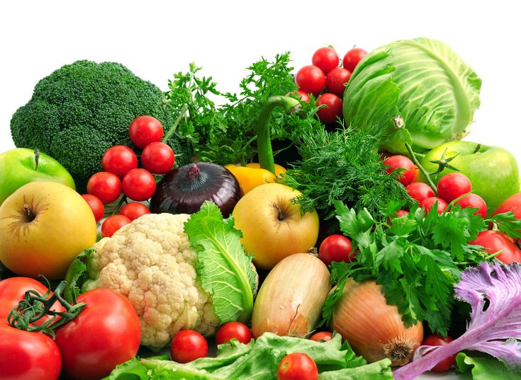
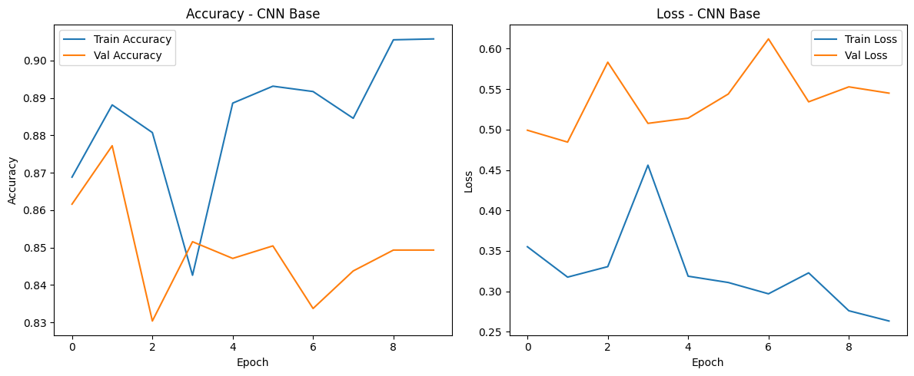
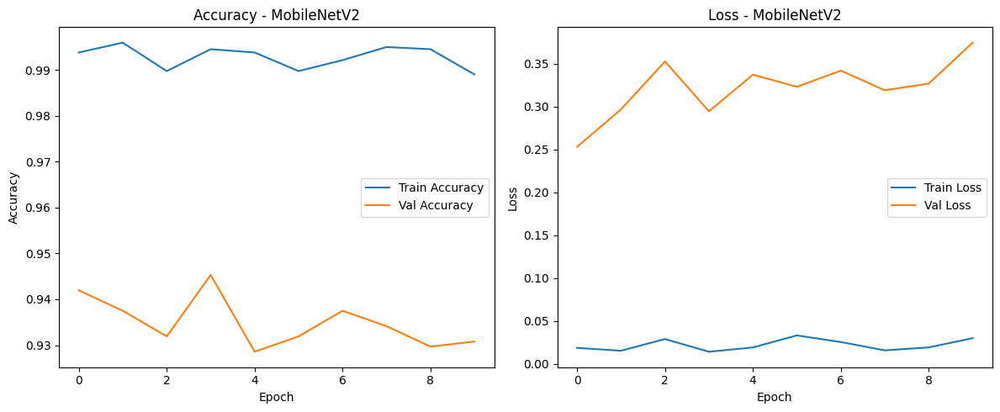
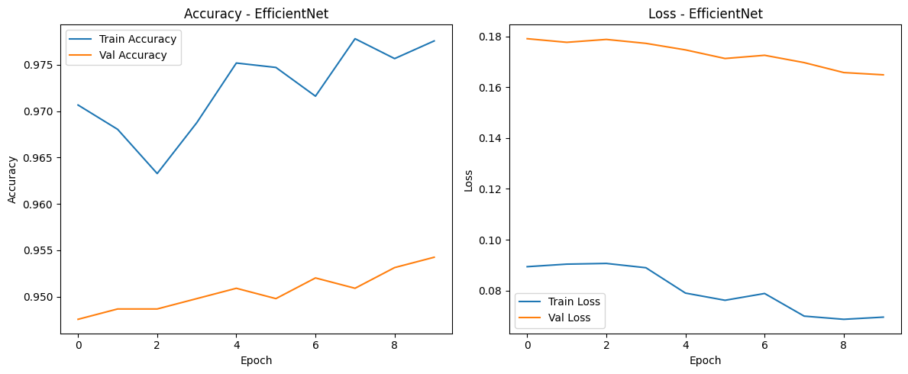

# 🥦 Vegetable Classification using Deep Learning

<p align="center">
  
</p>


---

## 📑 Daftar Isi
- [Deskripsi Proyek](#deskripsi-proyek)
- [Dataset](#dataset)
- [Preprocessing Data](#preprocessing-data)
- [Model yang Digunakan](#model-yang-digunakan)
- [Hasil Evaluasi dan Analisis Perbandingan](#hasil-evaluasi-dan-analisis-perbandingan)
- [Visualisasi Akurasi Model](#visualisasi-akurasi-model)
- [Confusion Matrix](#confusion-matrix)
- [Implementasi Sistem Website](#implementasi-sistem-website)
- [Panduan Menjalankan Sistem Secara Lokal](#panduan-menjalankan-sistem-secara-lokal)
- [Struktur Repository](#struktur-repository)
- [Kesimpulan](#kesimpulan)

---

## Deskripsi Proyek
Proyek **Vegetable Classification** bertujuan untuk mengklasifikasikan jenis sayuran berdasarkan citra digital menggunakan pendekatan **Deep Learning berbasis Convolutional Neural Network (CNN)**.

Pada proyek ini, dilakukan **perbandingan performa tiga model CNN**, yaitu **CNN Base**, **MobileNetV2**, dan **EfficientNet**, untuk mengetahui model dengan kinerja terbaik dalam mengenali berbagai jenis sayuran. Setiap model dilatih dan dievaluasi menggunakan dataset citra sayuran yang sama sehingga hasil perbandingan bersifat objektif.

Sistem ini tidak hanya berfokus pada proses pelatihan dan evaluasi model, tetapi juga diimplementasikan dalam bentuk **aplikasi website interaktif berbasis Streamlit**. Aplikasi tersebut memungkinkan pengguna untuk mengunggah gambar sayuran dan memperoleh hasil klasifikasi secara **real-time** beserta **confidence score** dari model yang digunakan.

Hasil dari proyek ini diharapkan dapat memberikan gambaran mengenai efektivitas berbagai arsitektur CNN dalam tugas klasifikasi citra, serta menunjukkan bagaimana model deep learning dapat diintegrasikan ke dalam aplikasi web yang mudah digunakan.


---

## Dataset
Dataset berupa citra sayuran dengan 10 kelas berbeda: 
5 kelas Fresh:
FreshBellpepper, FreshCarrot, FreshCucumber, FreshPotato, FreshTomato

5 kelas Rotten:
RottenBellpepper, RottenCarrot, RottenCucumber, RottenPotato, RottenTomato

📌 **Sumber Dataset**  
https://www.kaggle.com/datasets/muhriddinmuxiddinov/fruits-and-vegetables-dataset

📌 **Jumlah Kelas**: 10  
📌 **Format**: JPG / PNG  
📌 **Pembagian Data**:
- Training
- Validation
- Testing

> ⚠️ Dataset tidak diunggah ke repository karena keterbatasan ukuran file GitHub.

---

## Preprocessing Data
Tahapan preprocessing:
Preprocessing data meliputi resize citra menjadi 224×224 piksel, normalisasi nilai piksel, serta data augmentation berupa rotasi, zoom, dan horizontal flip pada data training. 

Untuk CNN Base digunakan normalisasi rescale 1/255, sedangkan pada model transfer learning (MobileNetV2 dan EfficientNet) digunakan fungsi preprocessing bawaan masing-masing arsitektur agar sesuai dengan bobot pretrained ImageNet.


---

## Model yang Digunakan

### 1️⃣ CNN Base (Non-Pretrained)
- Model **Convolutional Neural Network (CNN)** yang dibangun dari awal tanpa bobot pretrained
- Menggunakan beberapa lapisan convolution, pooling, dan fully connected
- Berfungsi sebagai **baseline** untuk membandingkan performa dengan model transfer learning
- Dilatih menggunakan normalisasi sederhana (rescale 1/255) dan data augmentation
- Memiliki kompleksitas komputasi rendah, namun performanya terbatas dibandingkan model pretrained

---

### 2️⃣ MobileNetV2 (Transfer Learning)
- Menggunakan arsitektur **MobileNetV2** dengan bobot pretrained dari **ImageNet**
- Dirancang untuk efisiensi komputasi dengan teknik **depthwise separable convolution**
- Cocok untuk aplikasi real-time dan perangkat dengan sumber daya terbatas
- Menggunakan preprocessing khusus MobileNetV2 agar sesuai dengan bobot pretrained
- Memberikan keseimbangan antara **akurasi dan kecepatan inferensi**

---

### 3️⃣ EfficientNet (Transfer Learning)
- Menggunakan arsitektur **EfficientNet** dengan konsep **compound scaling** (depth, width, dan resolution)
- Bobot awal berasal dari pelatihan pada dataset **ImageNet**
- Memiliki performa terbaik dalam eksperimen klasifikasi sayuran
- Lebih stabil dalam mengenali variasi citra sayuran segar dan busuk
- Memberikan **akurasi tertinggi** dibandingkan CNN Base dan MobileNetV2

📌 **Model (.keras)** tersedia melalui Google Drive  
    https://drive.google.com/drive/folders/1xSYJ8mFahz6AF2lmTf5HAKIrxH6XmyAN?usp=sharing

---

## Hasil Evaluasi dan Analisis Perbandingan

### 📊 Tabel Perbandingan Performa Model

### 📊 Tabel Perbandingan Performa Model

| Model | Accuracy | Loss | Analisis Singkat |
|------|----------|------|-----------------|
| CNN Base | 83.61% | 0.5557 | Model baseline, performa cukup baik namun terbatas karena dilatih dari awal |
| MobileNetV2 | 93.84% | 0.3618 | Transfer learning meningkatkan akurasi secara signifikan dan efisien |
| EfficientNet | **95.27%** | **0.1501** | Performa terbaik dengan stabilitas dan generalisasi tertinggi |


📌 **Analisis**:
Berdasarkan hasil pengujian pada data test, model EfficientNet memperoleh akurasi tertinggi sebesar 95.27%, diikuti oleh MobileNetV2 sebesar 93.84%, dan CNN Base sebesar 83.61%. 

Hasil ini menunjukkan bahwa penggunaan transfer learning secara signifikan meningkatkan performa model dibandingkan CNN yang dilatih dari awal. EfficientNet memberikan performa terbaik karena arsitekturnya mampu menyeimbangkan kompleksitas model dan efisiensi komputasi melalui teknik compound scaling.


---

## 📈 Visualisasi Akurasi Model

### CNN Base
<p align="center">
  
</p>

### MobileNetV2
<p align="center">
  
</p>

### EfficientNet
<p align="center">
  
</p>

---

## 📊 Confusion Matrix

### CNN Base
<p align="center">
  
</p>

### MobileNetV2
<p align="center">
  
</p>

### EfficientNet
<p align="center">
  
</p>

---

## Implementasi Sistem Website
Aplikasi web dikembangkan menggunakan **Streamlit**, memungkinkan pengguna:
- Upload gambar sayuran
- Melihat hasil klasifikasi
- Menampilkan confidence score

---

## Panduan Menjalankan Sistem Secara Lokal

```bash
git clone https://github.com/linaambn/vegetable-classification.git
cd vegetable-classification
pip install -r requirements.txt
streamlit run app.py

---

## 📂 Struktur Repository

vegetable-classification/
│
├── assets/ # Gambar dokumentasi & visualisasi
│ ├── cover.jpg # Gambar utama proyek
│ ├── acc_cnn_base.png # Plot akurasi CNN Base
│ ├── acc_mobilenetv2.png # Plot akurasi MobileNetV2
│ ├── acc_efficientnet.png # Plot akurasi EfficientNet
│ ├── Confusion Matrix-CNN Base.png
│ ├── Confusion Matrix-MobileNetV2.png
│ └── Confusion Matrix-Efficientnet.png
│
├── model_artifacts/ # Model hasil training & artefak
│ ├── cnn_base.keras
│ ├── mobilenet.keras
│ ├── efficientnet.keras
│ ├── class_indices.json
│ ├── CNN_Base_history.png
│ ├── MobileNetV2_history.png
│ └── EfficientNet_history.png
│
├── app.py # Aplikasi Streamlit
├── requirements.txt # Daftar dependency Python
├── dataset_uap.zip # Dataset (opsional)
├── .gitignore
└── README.md

---
## 🧾 Kesimpulan

Berdasarkan hasil eksperimen dan evaluasi yang telah dilakukan, dapat disimpulkan bahwa:

- Model **CNN Base** sebagai model non-pretrained mampu memberikan performa yang cukup baik sebagai baseline dengan akurasi sebesar **83.61%**, namun masih memiliki keterbatasan dalam menangkap fitur kompleks pada citra.
- Model **MobileNetV2** dengan pendekatan **transfer learning** menunjukkan peningkatan performa yang signifikan dengan akurasi **93.84%**, serta lebih efisien secara komputasi sehingga cocok untuk aplikasi real-time.
- Model **EfficientNet** menghasilkan performa terbaik dengan akurasi tertinggi sebesar **95.27%**, serta memiliki kemampuan generalisasi yang lebih stabil dalam membedakan sayuran segar dan busuk.

Hasil ini membuktikan bahwa penggunaan **transfer learning** mampu meningkatkan performa klasifikasi citra secara signifikan dibandingkan CNN yang dilatih dari awal.  
Berdasarkan hasil perbandingan, **EfficientNet** direkomendasikan sebagai model terbaik untuk sistem klasifikasi jenis sayuran berbasis citra pada proyek ini.
